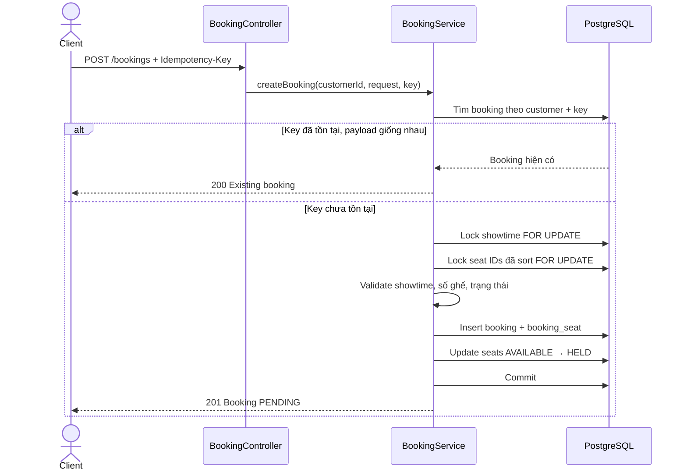

# Phase 2 — Booking với Concurrency Control

Tài liệu này là kế hoạch triển khai Phase 2 cho hệ thống đặt vé xem phim. Trọng tâm của phase là **UC-05: chọn ghế và tạo booking**, đồng thời xử lý các rủi ro toàn vẹn dữ liệu **BT-01, BT-02, BT-04 và BT-05**.

> Mục tiêu quan trọng nhất: với mọi mức độ tải, một ghế của một suất chiếu không thể thuộc về hai booking đang hoạt động.

## 1. Trạng thái dự án trước Phase 2

Phase 1 đã có các thành phần nền tảng:

- Domain phim, rạp, phòng chiếu, ghế và suất chiếu.
- `showtime_seat` là bản chụp ghế và giá tại thời điểm tạo suất chiếu.
- Trạng thái ghế theo suất: `AVAILABLE`, `HELD`, `BOOKED`.
- `@Version` trên `ShowtimeSeat` và unique constraint `(showtime_id, seat_id)`.
- API tạo/duyệt/hủy suất chiếu và truy vấn suất chiếu khả dụng.
- Các port chờ booking: `MovieBookingPort`, `ShowtimeRefundPort`.
- PostgreSQL, Flyway, Spring Data JPA, validation và MapStruct.

Những phần còn thiếu để hoàn thành luồng đặt vé:

- Chưa có domain và bảng `booking`, `booking_seat`.
- Chưa có API xem seat map theo suất chiếu.
- Chưa có transaction khóa các ghế được chọn.
- Chưa có idempotency để chống tạo booking trùng khi client retry.
- Chưa có cách lấy danh tính khách hàng từ authentication.
- Chưa có test concurrency chạy trên PostgreSQL thật.

## 2. Phạm vi Phase 2

### Trong phạm vi

- Xem seat map của một suất chiếu.
- Chọn từ 1 đến 8 ghế và tạo booking `PENDING`.
- Tính tổng tiền từ giá snapshot trong `showtime_seat`.
- Giữ toàn bộ ghế trong một transaction hoặc không giữ ghế nào.
- Chống double booking và overselling bằng pessimistic lock.
- Khóa ghế theo thứ tự ID thống nhất để giảm nguy cơ deadlock.
- Hỗ trợ `Idempotency-Key` và phát hiện cùng key nhưng khác payload.
- Giữ ghế trong 10 phút và giải phóng booking hết hạn.
- Chuẩn hóa lỗi nghiệp vụ, đặc biệt là `409 Conflict`.
- Unit test, repository integration test và concurrency test.

### Ngoài phạm vi

- Tích hợp VNPay, MoMo, Stripe hoặc payment gateway khác.
- Xác nhận thanh toán và chuyển `PENDING → CONFIRMED`.
- Hoàn tiền và chính sách hủy vé.
- Coupon, pricing động và báo cáo doanh thu.
- WebSocket cho seat map real-time; Phase 2 dùng polling.
- Queue/distributed lock cho nhiều instance ứng dụng.
- Xây dựng đầy đủ module đăng ký/đăng nhập và phân quyền.

## 3. Điều chỉnh ranh giới với Phase 3

Tài liệu use case hiện xếp seat hold/TTL vào Phase 3, nhưng UC-05 của Phase 2 lại tạo booking `PENDING`. Nếu không có TTL, một booking chưa thanh toán có thể khóa ghế vô thời hạn.

Vì vậy Phase 2 nên triển khai **TTL tối thiểu**:

- Booking mới có `expires_at = now + 10 phút`.
- Ghế chuyển `AVAILABLE → HELD`, chưa chuyển `BOOKED`.
- Scheduler đổi booking hết hạn thành `EXPIRED` và trả ghế về `AVAILABLE`.
- Phase 3 tiếp tục dùng nền móng này để thêm payment callback và luồng `PENDING → CONFIRMED`.

Đây là thay đổi nhỏ về phạm vi nhưng tránh phải thiết kế lại schema và trạng thái ghế ở Phase 3.

## 4. Quyết định kiến trúc

### 4.1 Nguồn sự thật của trạng thái ghế

`showtime_seat` là nguồn sự thật để quyết định ghế có thể đặt hay không. `booking_seat` là dữ liệu lịch sử/snapshot của booking.

Không đặt unique constraint vĩnh viễn chỉ trên `booking_seat.showtime_seat_id`, vì một ghế cần có khả năng được đặt lại sau khi booking cũ `EXPIRED` hoặc `CANCELLED`. Double booking được chặn bằng row lock và trạng thái trên `showtime_seat`.

### 4.2 Chiến lược khóa

Trong cùng một transaction:

1. Khóa dòng `showtime` bằng `PESSIMISTIC_WRITE`.
2. Sắp xếp danh sách `showtimeSeatId` tăng dần.
3. Khóa các dòng `showtime_seat` bằng `SELECT ... FOR UPDATE` và `ORDER BY id`.
4. Kiểm tra đủ số ghế, đúng suất chiếu và tất cả còn `AVAILABLE`.
5. Tạo booking cùng các booking seat.
6. Chuyển tất cả ghế sang `HELD` và ghi `held_at`.
7. Commit một lần.

Khóa `showtime` trước giúp việc đặt vé không chạy đồng thời với thao tác hủy suất chiếu. Tất cả luồng ghi liên quan phải tuân theo cùng thứ tự khóa: **showtime trước, showtime seat sau**.

`@Version` vẫn được giữ như lớp bảo vệ thứ hai, nhưng không thay thế pessimistic lock trong luồng booking.

### 4.3 Idempotency

- Client gửi header `Idempotency-Key` dạng UUID.
- Database có unique constraint `(customer_id, idempotency_key)`.
- Booking lưu thêm `request_hash`, được tạo từ `showtimeId` và danh sách seat ID đã sort.
- Nếu key đã tồn tại và hash giống nhau: trả lại booking cũ, không tạo bản ghi mới.
- Nếu key đã tồn tại nhưng hash khác nhau: trả `409 Conflict`.
- Nếu hai request cùng key đến đồng thời: unique constraint là chốt chặn cuối; service bắt lỗi constraint và đọc lại booking hiện có.

### 4.4 Danh tính người dùng

Phase 1 chưa có authentication. Không nên nhận `customerId` trực tiếp trong request body vì client có thể giả mạo người khác.

Tạo port `CurrentCustomerPort` với hàm `getCurrentCustomerId()`:

- Test dùng fake adapter.
- Local development có thể dùng adapter đọc một header riêng, chỉ bật bằng profile `local`.
- Khi triển khai Spring Security, thay adapter bằng dữ liệu từ authenticated principal mà không đổi `BookingService`.

Trong Phase 2, `booking.customer_id` chưa cần foreign key nếu chưa có bảng user. Khi module identity được thêm, tạo migration bổ sung foreign key.

## 5. Mô hình dữ liệu đề xuất

Tạo migration `V4__create_booking.sql`.

### Bảng `booking`

| Cột | Kiểu | Ý nghĩa |
|---|---|---|
| `id` | `BIGSERIAL` | Khóa chính |
| `booking_code` | `VARCHAR(20)` | Mã public, unique, không lộ sequence ID |
| `customer_id` | `BIGINT` | ID khách hàng từ identity port |
| `showtime_id` | `BIGINT` | FK tới `showtime` |
| `status` | `SMALLINT` | `PENDING`, `CONFIRMED`, `CANCELLED`, `EXPIRED` |
| `total_amount` | `DECIMAL(12,0)` | Tổng giá snapshot của các ghế |
| `expires_at` | `TIMESTAMPTZ` | Hạn thanh toán/giữ ghế |
| `idempotency_key` | `UUID` | Key chống request trùng |
| `request_hash` | `VARCHAR(64)` | Hash payload chuẩn hóa |
| audit columns | `TIMESTAMPTZ/BIGINT` | Đồng nhất `BaseAuditEntity` |

Index/constraint cần có:

- Unique `booking_code`.
- Unique `(customer_id, idempotency_key)`.
- Index `(customer_id, created_at DESC)` để chuẩn bị cho lịch sử booking.
- Partial index `(expires_at) WHERE status = PENDING` phục vụ scheduler.
- Index `showtime_id` phục vụ hủy suất và truy vấn booking.

### Bảng `booking_seat`

| Cột | Kiểu | Ý nghĩa |
|---|---|---|
| `id` | `BIGSERIAL` | Khóa chính |
| `booking_id` | `BIGINT` | FK tới booking |
| `showtime_seat_id` | `BIGINT` | FK tới ghế của suất chiếu |
| `seat_label` | `VARCHAR(10)` | Snapshot như `A1`, `B5` |
| `seat_type` | `SMALLINT` | Snapshot loại ghế |
| `price` | `DECIMAL(10,0)` | Snapshot giá tại lúc đặt |

Constraint cần có:

- Unique `(booking_id, showtime_seat_id)` để một ghế không lặp trong cùng booking.
- Check `price >= 0`.
- Không cascade delete booking hoặc booking seat; đây là dữ liệu giao dịch cần giữ lịch sử.

## 6. Domain và package dự kiến

```text
vn.cinema
├── api
│   └── BookingController
├── app
│   ├── dto
│   │   ├── request
│   │   │   └── CreateBookingRequest
│   │   └── response
│   │       ├── BookingResponse
│   │       └── ShowtimeSeatResponse
│   ├── mapper
│   │   └── BookingMapper
│   └── service
│       ├── BookingService
│       └── BookingExpiryService
├── domain
│   ├── booking
│   │   ├── entity
│   │   │   ├── Booking
│   │   │   ├── BookingSeat
│   │   │   └── BookingStatus
│   │   ├── repository
│   │   │   ├── BookingRepository
│   │   │   └── BookingSeatRepository
│   │   └── port
│   │       └── CurrentCustomerPort
│   └── common
│       └── exception
│           ├── ConflictException
│           └── BusinessRuleException
└── infrastructure
    └── scheduler
        └── BookingExpiryScheduler
```

Các state transition trong Phase 2:

```text
Booking:      [new] → PENDING → EXPIRED
ShowtimeSeat: AVAILABLE → HELD → AVAILABLE
```

Phase 3 bổ sung:

```text
Booking:      PENDING → CONFIRMED → CANCELLED
ShowtimeSeat: HELD    → BOOKED    → AVAILABLE (nếu chính sách cho phép hủy)
```

State transition phải nằm trong method của entity, không set status tùy ý từ controller/service.

## 7. API contract

### 7.1 Xem seat map

```http
GET /api/v1/showtimes/{showtimeId}/seats
```

Response tối thiểu:

```json
{
  "showtimeId": 101,
  "status": "OPEN",
  "startTime": "2026-07-20T12:00:00Z",
  "expiresAfterSeconds": 600,
  "seats": [
    {
      "showtimeSeatId": 1001,
      "label": "A1",
      "type": "STANDARD",
      "price": 75000,
      "status": "AVAILABLE"
    }
  ]
}
```

Phase 2 dùng polling mỗi 3–5 giây. Response chỉ phản ánh trạng thái tại thời điểm đọc; kết quả cuối cùng vẫn được quyết định trong transaction tạo booking.

### 7.2 Tạo booking

```http
POST /api/v1/bookings
Idempotency-Key: 0d3b729d-aea4-47af-a3ff-b68a1de9f179
Content-Type: application/json
```

```json
{
  "showtimeId": 101,
  "showtimeSeatIds": [1001, 1002]
}
```

Response `201 Created` ở lần đầu, hoặc `200 OK` khi replay cùng idempotency key:

```json
{
  "bookingCode": "BK7F3K9Q2",
  "showtimeId": 101,
  "status": "PENDING",
  "seats": [
    { "label": "A1", "price": 75000 },
    { "label": "A2", "price": 75000 }
  ],
  "totalAmount": 150000,
  "expiresAt": "2026-07-15T09:10:00Z"
}
```

### 7.3 Mã lỗi

| Tình huống | HTTP status |
|---|---|
| Request sai định dạng, rỗng hoặc quá 8 ghế | `400 Bad Request` |
| Chưa đăng nhập | `401 Unauthorized` |
| Showtime/seat không tồn tại | `404 Not Found` |
| Showtime không `OPEN` hoặc đã bắt đầu | `409 Conflict` |
| Một hoặc nhiều ghế không còn khả dụng | `409 Conflict` |
| Idempotency key được dùng với payload khác | `409 Conflict` |

Error response nên có thêm `code` ổn định, ví dụ `SEAT_NOT_AVAILABLE`, để client không phụ thuộc vào nội dung message.

## 8. Luồng transaction tạo booking



Pseudo-code:

```java
@Transactional
BookingResponse createBooking(Long customerId, UUID key, CreateBookingRequest request) {
    List<Long> seatIds = normalizeAndValidate(request.getShowtimeSeatIds());
    String requestHash = hash(request.getShowtimeId(), seatIds);

    return bookingRepository.findByCustomerIdAndIdempotencyKey(customerId, key)
            .map(existing -> replayOrConflict(existing, requestHash))
            .orElseGet(() -> createNewBooking(customerId, key, requestHash, request, seatIds));
}
```

Không dùng `synchronized` hoặc in-memory lock vì chúng không bảo vệ được khi ứng dụng chạy nhiều instance.

## 9. Quy tắc nghiệp vụ bắt buộc

Trước khi ghi booking, service phải kiểm tra:

1. Có từ 1 đến 8 seat ID.
2. Danh sách không có ID trùng.
3. Showtime tồn tại và đang `OPEN`.
4. Showtime chưa bắt đầu. Quy tắc chặn trước 30 phút vẫn để Phase 6.
5. Tất cả `showtime_seat` tồn tại và thuộc đúng showtime.
6. Số dòng lock được bằng đúng số ID request.
7. Tất cả ghế đang `AVAILABLE`.
8. Ghế vật lý vẫn active.
9. Tổng tiền được cộng từ `showtime_seat.price`, không nhận từ client.
10. Mọi thay đổi thành công hoặc rollback toàn bộ.

## 10. Kế hoạch triển khai theo chặng

### Chặng 1 — Chuẩn bị nền tảng

- Tạo migration V4 và entity/converter/repository cho booking.
- Thêm exception nghiệp vụ có error code.
- Thêm cấu hình `cinema.booking.hold-duration=10m`.
- Tạo `CurrentCustomerPort` và adapter cho test/local.

**Kết quả:** ứng dụng khởi động, Flyway validate thành công, repository mapping đúng schema.

### Chặng 2 — Seat map

- Thêm repository query lấy seat map theo showtime.
- Thêm response DTO và mapper.
- Thêm `GET /api/v1/showtimes/{id}/seats`.
- Không trả entity JPA trực tiếp từ API.

**Kết quả:** client có đủ ID, label, type, price và status để chọn ghế.

### Chặng 3 — Booking transaction

- Thêm query khóa showtime và danh sách seat bằng pessimistic write lock.
- Thêm `CreateBookingRequest`, `BookingResponse`, mapper và service.
- Thêm validation 1–8 ghế, cùng showtime, trạng thái `AVAILABLE`.
- Tạo booking + booking seat và chuyển ghế sang `HELD` trong một transaction.
- Cập nhật luồng hủy showtime để dùng cùng thứ tự khóa.

**Kết quả:** booking nguyên tử, không double booking và không partial booking.

### Chặng 4 — Idempotency

- Đọc/validate `Idempotency-Key` tại controller.
- Chuẩn hóa payload và lưu request hash.
- Xử lý replay và concurrent insert trùng key.
- Trả `201` cho lần tạo đầu và `200` cho replay.

**Kết quả:** retry do timeout/network không tạo thêm booking.

### Chặng 5 — Expiry tối thiểu

- Thêm scheduler tìm booking `PENDING` đã hết hạn theo batch.
- Mỗi batch lock booking và seat theo thứ tự thống nhất.
- Chuyển booking sang `EXPIRED`, seat `HELD → AVAILABLE`.
- Bảo đảm scheduler chạy lặp lại vẫn cho cùng kết quả.

**Kết quả:** ghế không bị giữ vĩnh viễn khi người dùng bỏ dở.

### Chặng 6 — Kiểm thử và hardening

- Hoàn thiện unit, integration, concurrency và API tests.
- Bổ sung log có `bookingCode`, `showtimeId`, `customerId`; không log dữ liệu nhạy cảm.
- Kiểm tra index bằng query plan cho các query lock/expiry.
- Chạy test lặp nhiều lần để phát hiện flaky race condition.

**Kết quả:** đạt Definition of Done và sẵn sàng nối payment ở Phase 3.

## 11. Chiến lược kiểm thử

### Unit test

- Reject 0 ghế, hơn 8 ghế và ID trùng.
- Reject showtime không `OPEN` hoặc đã bắt đầu.
- Reject ghế sai showtime, inactive, `HELD` hoặc `BOOKED`.
- Tính đúng `totalAmount` từ snapshot price.
- Cùng idempotency key + cùng payload trả booking cũ.
- Cùng idempotency key + khác payload trả conflict.
- Expire booking trả toàn bộ ghế về `AVAILABLE`.

### PostgreSQL integration test

Concurrency test không nên chạy trên H2 vì hành vi lock và transaction khác PostgreSQL. Dùng Testcontainers PostgreSQL và chạy Flyway thật.

Các scenario bắt buộc:

1. 20 request đồng thời đặt cùng một ghế: đúng 1 request thành công.
2. Hai request đặt `[A1, A2]` và `[A2, A1]`: không deadlock; tối đa 1 booking thành công.
3. Một request chọn `[A1, A2, A3]` khi A2 đã bị giữ: request thất bại và A1/A3 vẫn `AVAILABLE`.
4. Hai request đồng thời dùng cùng idempotency key: chỉ có 1 booking.
5. Scheduler chạy đồng thời trên cùng booking hết hạn: ghế chỉ được giải phóng một lần về mặt trạng thái.
6. Hủy showtime chạy đồng thời với tạo booking: không có booking active trên showtime đã `CANCELLED`.

### API test

- Validate status code và error code.
- Không lộ stack trace hoặc tên constraint database.
- Response booking giữ nguyên khi replay.

## 12. Definition of Done

Phase 2 hoàn thành khi đáp ứng toàn bộ điều kiện:

- [ ] Migration V4 chạy được trên database trống và database đã có V1–V3.
- [ ] Seat map API trả đúng snapshot ghế của showtime.
- [ ] Booking API không tin giá hoặc customer ID từ request body.
- [ ] Transaction lock showtime trước, seat sau và sort seat ID.
- [ ] Không thể tạo partial booking.
- [ ] Test đồng thời chứng minh một ghế chỉ có tối đa một booking active.
- [ ] Retry cùng idempotency key không tạo booking mới.
- [ ] Booking hết hạn được chuyển `EXPIRED` và ghế được giải phóng.
- [ ] Lỗi tranh chấp trả `409` với error code ổn định.
- [ ] Unit/API tests pass; integration tests chạy trên PostgreSQL.
- [ ] `mvn test` pass trong môi trường test có database.
- [ ] README/API examples được cập nhật nếu contract thay đổi.

## 13. Ước lượng và thứ tự ưu tiên

| Hạng mục | Ước lượng | Ưu tiên |
|---|---:|---|
| Schema + domain booking | 1 ngày | P0 |
| Seat map API | 0.5 ngày | P0 |
| Transaction + pessimistic locking | 1.5 ngày | P0 |
| Idempotency | 1 ngày | P0 |
| Expiry scheduler tối thiểu | 1 ngày | P0 |
| Unit/API tests | 1 ngày | P0 |
| PostgreSQL concurrency tests | 1.5 ngày | P0 |
| Logging, query plan, tài liệu | 0.5 ngày | P1 |

Tổng ước lượng: **8 ngày kỹ thuật**, chưa tính thời gian xây dựng authentication đầy đủ hoặc CI infrastructure.

## 14. Rủi ro và cách giảm thiểu

| Rủi ro | Tác động | Giảm thiểu |
|---|---|---|
| Deadlock khi hai request chọn nhiều ghế | Transaction rollback, UX xấu | Sort ID và thống nhất lock order |
| Lock chờ quá lâu khi suất hot | Tăng latency | Đặt lock timeout, trả conflict/retry phù hợp |
| Unique idempotency race | Tạo lỗi 500 | Catch constraint cụ thể và đọc booking hiện có |
| Scheduler chạy trên nhiều instance | Xử lý trùng | Row lock hoặc `SKIP LOCKED`, state transition idempotent |
| Hủy showtime đồng thời với booking | Booking trên suất đã hủy | Lock showtime trong cả hai luồng |
| Test xanh trên H2 nhưng lỗi production | Sai kỳ vọng locking | Test concurrency bằng PostgreSQL thật |
| Client tin seat map cũ | Chọn ghế vừa bị người khác giữ | API booking revalidate trong transaction |

## 15. Chuẩn bị cho Phase 3

Sau Phase 2, Phase 3 chỉ cần nối thêm lifecycle thay vì viết lại booking core:

- Payment initiation cho booking `PENDING`.
- Webhook idempotent chuyển booking sang `CONFIRMED`.
- Ghế chuyển `HELD → BOOKED` sau thanh toán thành công.
- Callback đến trễ sau expiry được từ chối hoặc refund.
- Lịch sử booking và hủy vé.
- Adapter thật cho `MovieBookingPort` và `ShowtimeRefundPort`.

Không nên bắt đầu payment trước khi concurrency test của Phase 2 ổn định, vì payment thành công cho một booking sai ghế là lỗi khó khôi phục hơn nhiều so với request booking bị từ chối.
