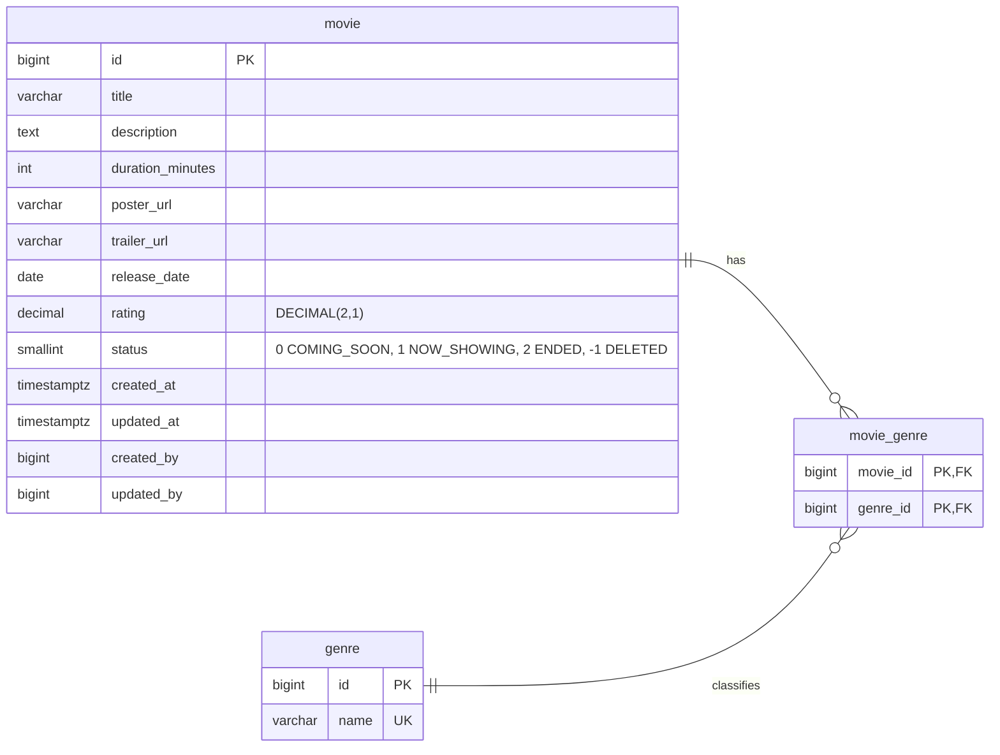
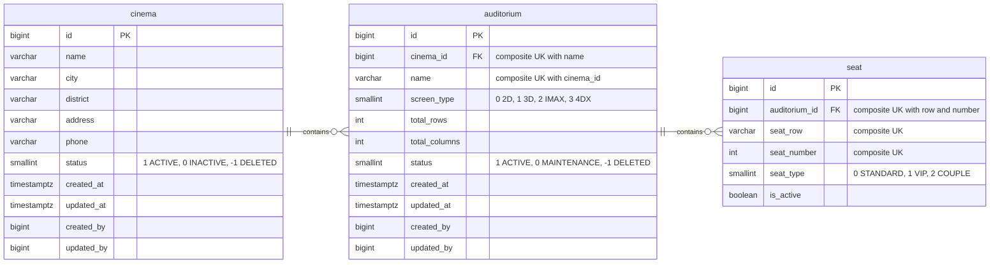
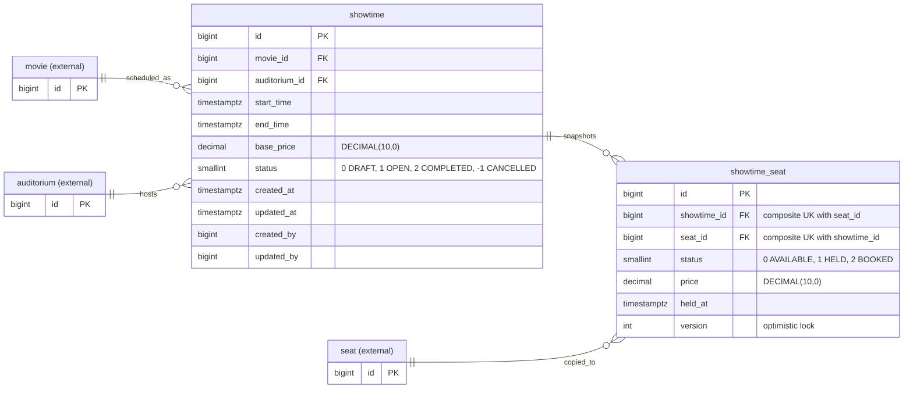
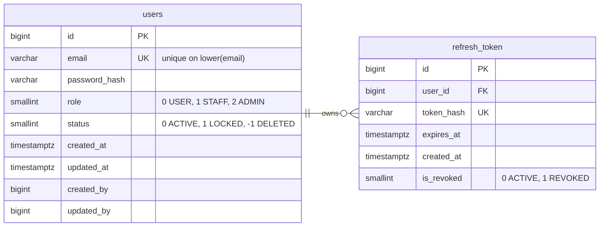
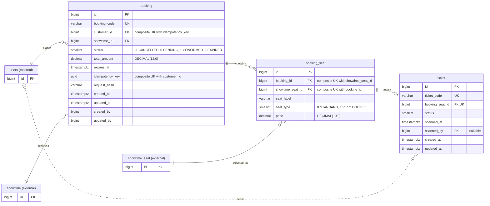
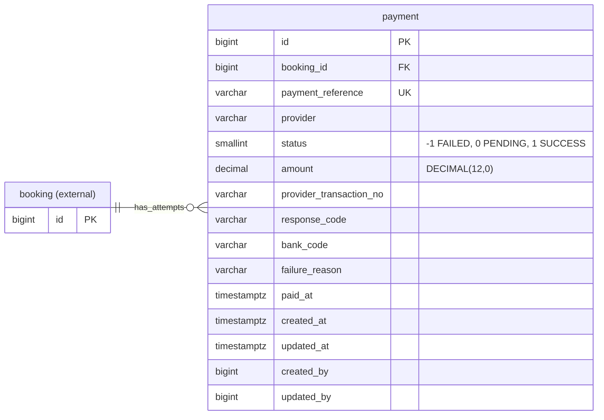
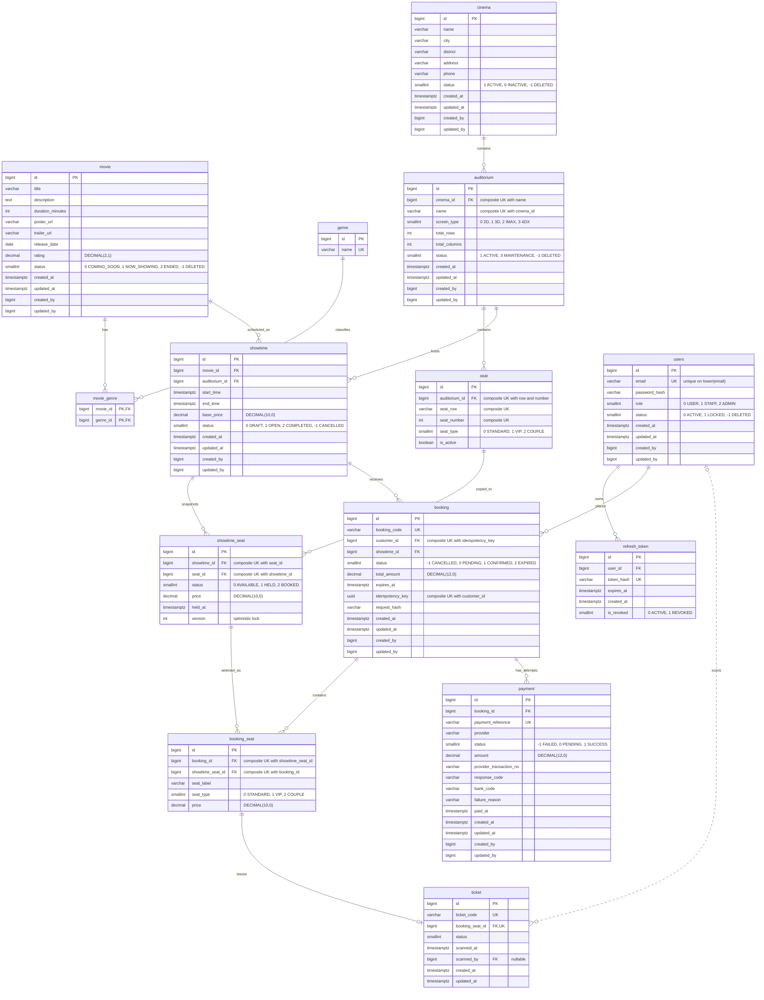

# ERD database từ Flyway migrations

Tài liệu này được dựng từ các migration `V1` đến `V9` trong
`src/main/resources/db/migration`. Migration `V8` chỉ seed dữ liệu nên không tạo
thêm bảng nghiệp vụ.

## Quy ước

- `PK`: primary key; `FK`: foreign key; `UK`: unique key/index.
- `||`: đúng một; `o|`: không hoặc một; `o{`: không hoặc nhiều.
- Đường liền biểu diễn quan hệ bắt buộc ở phía giữ FK; đường chấm dùng cho FK
  nullable (`ticket.scanned_by`).
- Các cột `created_by` và `updated_by` là `BIGINT`, nhưng Flyway không khai báo
  FK tới `users`, vì vậy sơ đồ không nối các cột audit này với bảng `users`.
- Các sơ đồ nhỏ là nhóm aggregate/domain theo package và trách nhiệm nghiệp vụ
  hiện tại. Entity có hậu tố `(external)` thuộc nhóm khác và chỉ được đưa vào để
  thấy dependency qua FK.

## 1. Movie Catalog

Aggregate chính: `movie`; `genre` là master-data dùng chung; `movie_genre` là
bảng liên kết N-N.

## 2. Cinema Layout

Aggregate/domain quản lý cấu trúc vật lý của rạp: `cinema` → `auditorium` →
`seat`.

## 3. Showtime Inventory

Aggregate chính: `showtime`; `showtime_seat` là snapshot tồn kho và giá ghế cho
từng suất chiếu.

## 4. Identity

Aggregate chính: `users`; `refresh_token` lưu lịch sử token đã băm phục vụ JWT
rotation.

## 5. Booking và Ticket

Aggregate `booking` sở hữu các snapshot `booking_seat`. `ticket` nằm trong
booking domain hiện tại và có quan hệ 0-1 với mỗi `booking_seat`.

## 6. Payment

Mỗi hàng `payment` là một payment attempt độc lập; một booking có thể có nhiều
lần thử thanh toán.

## 7. Toàn bộ database hiện có

Sơ đồ này chứa đủ 14 bảng nghiệp vụ được tạo bởi Flyway. Bảng metadata nội bộ
`flyway_schema_history` không được đưa vào vì không thuộc schema nghiệp vụ của
ứng dụng.

## Danh sách FK hiện có

| Bảng con | Cột FK | Bảng cha | Ghi chú |
|---|---|---|---|
| `movie_genre` | `movie_id` | `movie.id` | `ON DELETE CASCADE` |
| `movie_genre` | `genre_id` | `genre.id` | `ON DELETE CASCADE` |
| `auditorium` | `cinema_id` | `cinema.id` |  |
| `seat` | `auditorium_id` | `auditorium.id` |  |
| `showtime` | `movie_id` | `movie.id` |  |
| `showtime` | `auditorium_id` | `auditorium.id` |  |
| `showtime_seat` | `showtime_id` | `showtime.id` |  |
| `showtime_seat` | `seat_id` | `seat.id` |  |
| `booking` | `customer_id` | `users.id` | Thêm ở `V5` |
| `booking` | `showtime_id` | `showtime.id` |  |
| `booking_seat` | `booking_id` | `booking.id` |  |
| `booking_seat` | `showtime_seat_id` | `showtime_seat.id` |  |
| `refresh_token` | `user_id` | `users.id` |  |
| `payment` | `booking_id` | `booking.id` |  |
| `ticket` | `booking_seat_id` | `booking_seat.id` | `UNIQUE`, tạo quan hệ 0-1 |
| `ticket` | `scanned_by` | `users.id` | Nullable |
