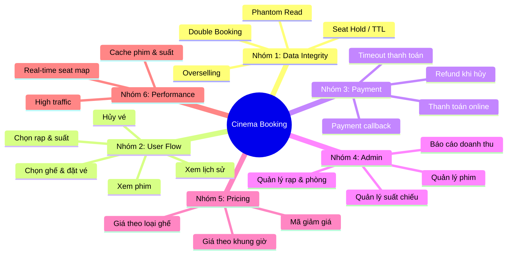

# 🎬 Tất Cả Bài Toán & Use Case — Hệ Thống Đặt Vé Xem Phim

## Tổng Quan Phân Nhóm

---

## Nhóm 1: Data Integrity (Toàn vẹn dữ liệu) 🔴

### BT-01: Double Booking (Đặt trùng ghế)

| Mục | Chi tiết |
|-----|---------|
| **Mô tả** | 2 user cùng đặt 1 ghế cùng lúc, cả 2 đều thành công |
| **Nguyên nhân** | Race condition: cả 2 đọc ghế trống → cả 2 ghi booking |
| **Hậu quả** | 1 ghế bán cho 2 người → xung đột tại rạp |
| **Giải pháp** | Pessimistic Lock (`SELECT FOR UPDATE`) + Unique Constraint `(showtime_id, seat_id)` |
| **Mức độ** | 🔴 Critical — phải có ngay từ đầu |

### BT-02: Overselling (Bán lố vé)

| Mục | Chi tiết |
|-----|---------|
| **Mô tả** | Phòng 100 ghế nhưng bán được 105 vé |
| **Nguyên nhân** | Không validate ở seat-level, chỉ đếm tổng số booking |
| **Hậu quả** | Khách đến rạp không có chỗ ngồi |
| **Giải pháp** | Booking theo **từng ghế cụ thể** → Unique Constraint tự ngăn overselling |
| **Mức độ** | 🔴 Critical — giải quyết cùng BT-01 |

### BT-03: Seat Hold & Expiry (Giữ ghế tạm thời)

| Mục | Chi tiết |
|-----|---------|
| **Mô tả** | User chọn ghế nhưng chưa thanh toán → ghế bị "treo" vô thời hạn |
| **Nguyên nhân** | Không có cơ chế hết hạn cho booking ở trạng thái PENDING |
| **Hậu quả** | Ghế bị khóa mãi, không ai đặt được, mất doanh thu |
| **Giải pháp** | `expires_at` + `@Scheduled` job giải phóng booking hết hạn (TTL 10 phút) |
| **Mức độ** | 🟡 Important |

### BT-04: Phantom Read khi chọn nhiều ghế

| Mục | Chi tiết |
|-----|---------|
| **Mô tả** | User chọn ghế A1, A2, A3. Giữa lúc validate và insert, người khác đặt mất A2 |
| **Nguyên nhân** | Transaction isolation không đủ chặt |
| **Hậu quả** | Booking thành công nhưng thiếu ghế, hoặc lỗi giữa chừng |
| **Giải pháp** | Lock **tất cả ghế** trong 1 transaction, sort theo ID tránh deadlock |
| **Mức độ** | 🔴 Critical |

### BT-05: Idempotency (Gửi request trùng lặp)

| Mục | Chi tiết |
|-----|---------|
| **Mô tả** | User click nút "Đặt vé" 2 lần liên tiếp (do mạng chậm) → tạo 2 booking |
| **Nguyên nhân** | API không idempotent |
| **Hậu quả** | Trừ tiền 2 lần, booking trùng |
| **Giải pháp** | Client gửi `idempotencyKey` (UUID) → server check trùng trước khi tạo booking |
| **Mức độ** | 🟡 Important |

---

## Nhóm 2: User Flow (Luồng người dùng) 🟢

### UC-01: Xem danh sách phim đang chiếu

| Mục | Chi tiết |
|-----|---------|
| **Actor** | User (không cần đăng nhập) |
| **Input** | Không bắt buộc. Optional: filter theo thể loại, tìm kiếm theo tên |
| **Output** | Danh sách phim: poster, tên, thể loại, thời lượng, đánh giá |
| **Business rule** | Chỉ hiện phim có `status = SHOWING` và có ít nhất 1 suất chiếu trong tương lai |

### UC-02: Xem chi tiết phim

| Mục | Chi tiết |
|-----|---------|
| **Actor** | User |
| **Input** | movieId |
| **Output** | Thông tin phim + danh sách rạp đang chiếu phim này |
| **Business rule** | Chỉ hiện rạp có suất chiếu từ ngày hiện tại trở đi |

### UC-03: Xem suất chiếu theo rạp + ngày

| Mục | Chi tiết |
|-----|---------|
| **Actor** | User |
| **Input** | movieId, cinemaId, date |
| **Output** | Danh sách suất chiếu: giờ bắt đầu, phòng chiếu, giá cơ bản, số ghế trống |
| **Business rule** | Không hiện suất chiếu đã qua (startTime < now). Không hiện suất đã hết ghế |

### UC-04: Xem sơ đồ ghế (Seat Map)

| Mục | Chi tiết |
|-----|---------|
| **Actor** | User |
| **Input** | showtimeId |
| **Output** | Grid ghế với trạng thái: AVAILABLE / HELD / BOOKED + loại ghế (Standard/VIP/Couple) |
| **Business rule** | Ghế đang HELD bởi booking PENDING chưa hết hạn → hiện "đang giữ" (không khả dụng) |

### UC-05: Chọn ghế & tạo booking

| Mục | Chi tiết |
|-----|---------|
| **Actor** | User (phải đăng nhập) |
| **Input** | showtimeId, List<seatId>, (optional) couponCode |
| **Output** | Booking với status=PENDING, tổng tiền, thời hạn thanh toán |
| **Business rule** | Max ghế/booking: 8. Ghế phải thuộc đúng screen của showtime. Không cho chọn ghế đã HELD/BOOKED. Tính giá theo loại ghế |
| **Concurrency** | Pessimistic Lock + Unique Constraint (BT-01) |

### UC-06: Xem lịch sử đặt vé

| Mục | Chi tiết |
|-----|---------|
| **Actor** | User (đăng nhập) |
| **Input** | userId, (optional) status filter |
| **Output** | Danh sách booking: phim, rạp, suất, ghế, trạng thái, giá |
| **Business rule** | Chỉ xem booking của chính mình. Sắp xếp theo ngày mới nhất |

### UC-07: Hủy vé

| Mục | Chi tiết |
|-----|---------|
| **Actor** | User (đăng nhập) |
| **Input** | bookingId |
| **Output** | Booking status → CANCELLED, ghế được giải phóng |
| **Business rule** | Chỉ hủy được trước suất chiếu ≥ 2 giờ. Booking đã CANCELLED/EXPIRED không hủy lại. Refund theo chính sách (xem BT-09) |

---

## Nhóm 3: Payment (Thanh toán) 💳

### BT-06: Thanh toán & trạng thái booking

| Mục | Chi tiết |
|-----|---------|
| **Mô tả** | Sau khi chọn ghế, user có 10 phút để thanh toán |
| **Flow** | `PENDING` →(thanh toán OK)→ `CONFIRMED` / →(hết hạn)→ `EXPIRED` |
| **Giải pháp** | Tích hợp payment gateway (VNPay/Momo/Stripe). Nhận callback xác nhận |

### BT-07: Payment Timeout

| Mục | Chi tiết |
|-----|---------|
| **Mô tả** | User bắt đầu thanh toán nhưng trang payment bị treo / user tắt trình duyệt |
| **Hậu quả** | Booking mãi ở trạng thái PENDING |
| **Giải pháp** | `expires_at` + Scheduled job (liên quan BT-03). Payment gateway cũng có timeout riêng |

### BT-08: Payment Callback bất đồng bộ

| Mục | Chi tiết |
|-----|---------|
| **Mô tả** | Payment gateway trả kết quả qua webhook (async). Server phải xử lý đúng |
| **Edge case** | Callback đến SAU khi booking đã EXPIRED → phải refund tự động |
| **Giải pháp** | Check booking status trước khi confirm. Nếu đã expired → trigger refund |

### BT-09: Refund khi hủy vé

| Mục | Chi tiết |
|-----|---------|
| **Mô tả** | User hủy vé đã thanh toán → hoàn tiền |
| **Business rule** | Hủy trước ≥ 24h: hoàn 100%. Hủy trước 2-24h: hoàn 50%. Hủy < 2h: không hoàn |
| **Giải pháp** | Tính refund amount dựa trên khoảng cách thời gian → gọi API refund payment gateway |

---

## Nhóm 4: Admin Operations 🔧

### UC-08: CRUD Phim

| Mục | Chi tiết |
|-----|---------|
| **Actor** | Admin |
| **Operations** | Thêm phim mới, sửa thông tin, đổi trạng thái (COMING_SOON → SHOWING → ENDED) |
| **Business rule** | Không xóa phim có booking CONFIRMED. Chỉ soft-delete (đổi status) |

### UC-09: CRUD Rạp & Phòng chiếu

| Mục | Chi tiết |
|-----|---------|
| **Actor** | Admin |
| **Operations** | Thêm rạp, thêm phòng chiếu, cấu hình layout ghế (số hàng, số cột, loại ghế) |
| **Business rule** | Khi thay đổi layout ghế → chỉ áp dụng cho suất chiếu MỚI, không ảnh hưởng suất đã tạo |

### UC-10: Quản lý suất chiếu

| Mục | Chi tiết |
|-----|---------|
| **Actor** | Admin |
| **Operations** | Tạo suất chiếu mới, hủy suất chiếu |
| **Business rule** | Không tạo suất trùng thời gian cùng phòng (phải tính cả thời lượng phim + 15' dọn phòng). Hủy suất có booking → phải refund toàn bộ |

### BT-10: Xung đột lịch chiếu (Schedule Conflict)

| Mục | Chi tiết |
|-----|---------|
| **Mô tả** | Admin tạo suất "Avengers 19:00-21:30" tại Phòng 1, nhưng Phòng 1 đã có suất "Spider-Man 20:00-22:00" |
| **Giải pháp** | Validate: `new_start < existing_end AND new_end > existing_start` → conflict |

### UC-11: Báo cáo doanh thu

| Mục | Chi tiết |
|-----|---------|
| **Actor** | Admin |
| **Output** | Doanh thu theo phim, theo rạp, theo ngày/tuần/tháng, tỷ lệ lấp đầy |

---

## Nhóm 5: Pricing & Promotions 💰

### BT-11: Giá theo loại ghế

| Mục | Chi tiết |
|-----|---------|
| **Mô tả** | Ghế Standard: 75k, VIP: 100k, Couple: 180k |
| **Giải pháp** | `seat_type` trong bảng Seat + bảng `PricePolicy(screen_type, seat_type, price)` |

### BT-12: Giá theo khung giờ / ngày

| Mục | Chi tiết |
|-----|---------|
| **Mô tả** | Suất sáng rẻ hơn suất tối. Cuối tuần đắt hơn ngày thường |
| **Giải pháp** | `base_price` trong Showtime + hệ số nhân theo khung giờ/ngày |

### BT-13: Mã giảm giá (Coupon / Voucher)

| Mục | Chi tiết |
|-----|---------|
| **Mô tả** | User nhập mã "SALE50" giảm 50%. Mã có giới hạn số lần dùng |
| **Edge case** | 100 người cùng dùng mã chỉ còn 1 lượt → race condition trên coupon usage count |
| **Giải pháp** | Atomic decrement: `UPDATE coupon SET remaining = remaining - 1 WHERE code = ? AND remaining > 0` |

---

## Nhóm 6: Performance & Scalability ⚡

### BT-14: Cache danh sách phim & suất chiếu

| Mục | Chi tiết |
|-----|---------|
| **Mô tả** | Trang chủ hiện danh sách phim → hàng ngàn request/giây cho cùng 1 data |
| **Giải pháp** | Cache với Redis/Caffeine. TTL 5-10 phút. Invalidate khi admin thay đổi |

### BT-15: Real-time Seat Map

| Mục | Chi tiết |
|-----|---------|
| **Mô tả** | Nhiều user cùng xem sơ đồ ghế, cần thấy trạng thái mới nhất |
| **Giải pháp giai đoạn 1** | Polling: client gọi API mỗi 5 giây |
| **Giải pháp giai đoạn 2** | WebSocket: server push khi có thay đổi |

### BT-16: Hot Showtime (Suất chiếu hot)

| Mục | Chi tiết |
|-----|---------|
| **Mô tả** | Phim blockbuster mở bán → hàng trăm người đặt cùng lúc → DB bottleneck |
| **Giải pháp** | Queue-based booking: request vào hàng đợi → xử lý tuần tự. Hoặc distributed lock với Redis |

---

## Nhóm 7: Edge Cases & Error Handling 🧩

### BT-17: Suất chiếu bị hủy sau khi đã bán vé

| Mục | Chi tiết |
|-----|---------|
| **Trigger** | Sự cố kỹ thuật, phim bị rút lịch |
| **Xử lý** | Tìm tất cả booking CONFIRMED → đổi status CANCELLED → refund 100% → notify user |

### BT-18: User chọn ghế nhưng suất sắp bắt đầu

| Mục | Chi tiết |
|-----|---------|
| **Rule** | Không cho đặt vé online nếu suất chiếu bắt đầu trong vòng 30 phút |
| **Giải pháp** | Check `showtime.startTime - now() >= 30 minutes` trước khi cho booking |

### BT-19: Ghế bị disable / bảo trì

| Mục | Chi tiết |
|-----|---------|
| **Mô tả** | Ghế hỏng, cần đánh dấu không khả dụng cho 1 hoặc nhiều suất |
| **Giải pháp** | `seat_status` field hoặc bảng `disabled_seat(seat_id, from_date, to_date)` |

### BT-20: Đồng bộ timezone

| Mục | Chi tiết |
|-----|---------|
| **Mô tả** | Server ở UTC, user ở GMT+7. Suất chiếu 19:00 VN phải hiện đúng |
| **Giải pháp** | Lưu showtime theo timezone rạp. API trả kèm timezone info |

---

## Ma Trận Ưu Tiên Triển Khai

| Phase | Bài toán | Use case | Mục tiêu |
|-------|----------|----------|----------|
| **Phase 1: Core** | — | UC-01→04, UC-08→10 | Entity, CRUD, xem phim & suất chiếu, sơ đồ ghế |
| **Phase 2: Booking** | BT-01, 02, 04, 05 | UC-05 | Đặt vé với concurrency control |
| **Phase 3: Lifecycle** | BT-03, 06, 07 | UC-06, 07 | Seat hold, payment, hủy vé |
| **Phase 4: Business** | BT-08→13 | — | Refund, pricing, coupon |
| **Phase 5: Scale** | BT-14→16 | — | Cache, real-time, queue |
| **Phase 6: Polish** | BT-17→20 | UC-11 | Edge cases, báo cáo |

> [!TIP]
> **Cho portfolio Intern/Fresher:** Phase 1 + 2 + 3 là đủ ấn tượng. Các bài toán concurrency (BT-01, 03, 04) là điểm nhấn kỹ thuật quan trọng nhất khi phỏng vấn.
